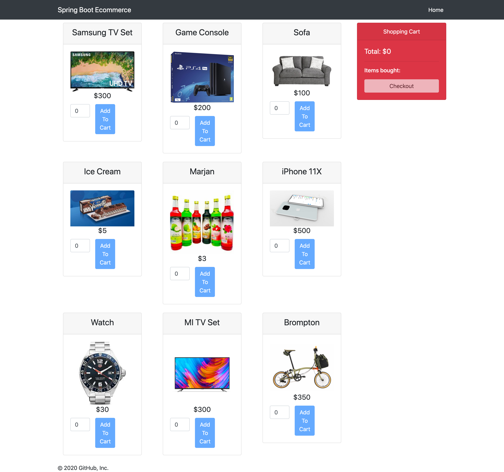
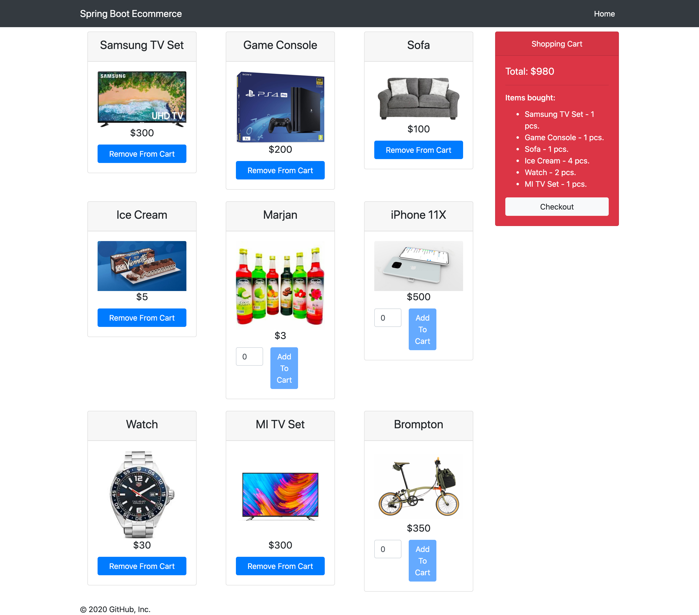
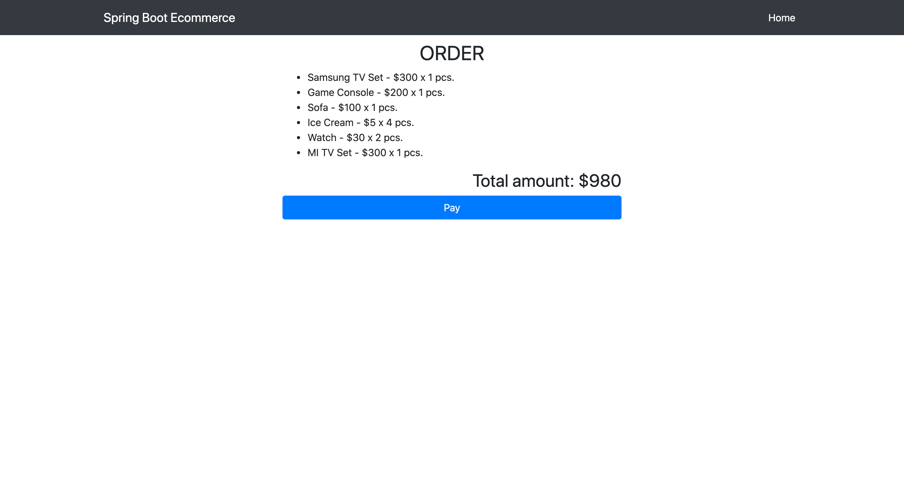
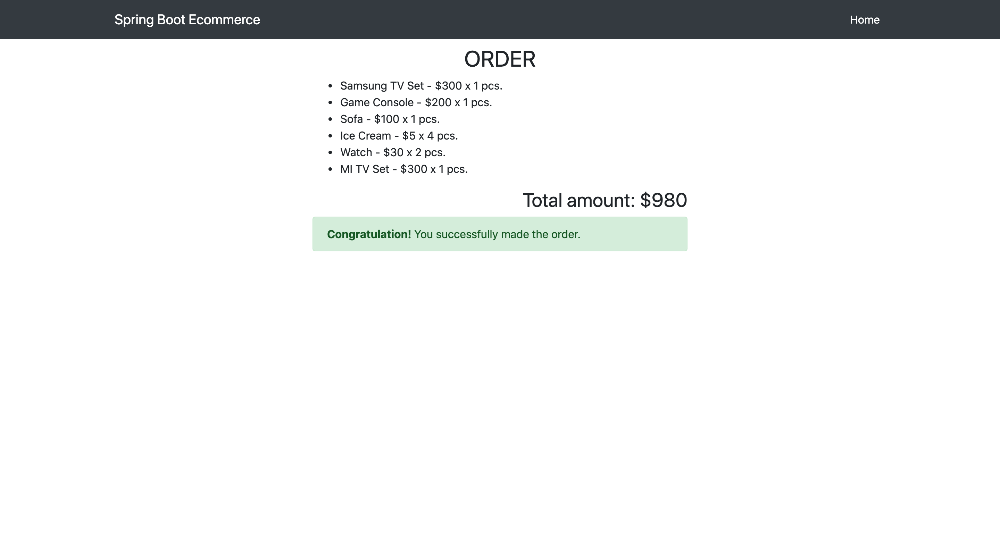

# springboot-ecommerce
#### Spring Boot Angular
A Simple E-Commerce Implementation with Spring

This module contains articles about Spring Boot with Angular

#### Technology Stacks
1. Java 8
2. Maven 3.6.3
3. IntelliJ Ultimate 2020.1
4. NodeJS v14.2.0
5. NPM 6.14.5
6. Angular CLI: 7.3.10
7. Angular: 7.2.16
8. H2 Database
9. Spring Boot Stack

### Things todo list:
1. Clone this repository: `git clone https://github.com/hendisantika/springboot-ecommerce.git`
2. Go inside the folder: `cd springboot-ecommerce`
3. Run the backend application: `mvn clean spring-boot:run`
4. Run Angular Application: `cd frontend && npm run start`
5. Open your favorite browser: http://localhost:4200

### Screen shot
 
Home Page

Order Page

Checkout Page

Pay order Page

